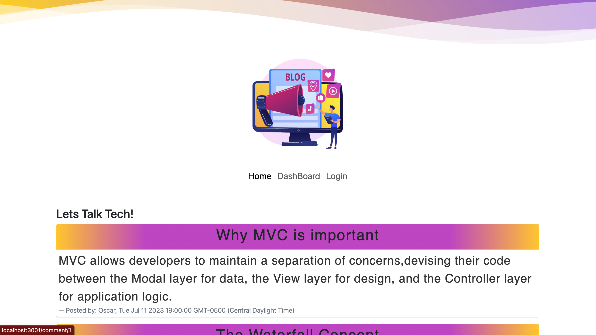

# Blog Post
  Project Created By: oscarl214
## License:

* This application is covered by the MIT license.  
## Description

A Tech Blog Post that allows users to create,edit,or delete post they have created. They can also leave a comment in any post theyd like!

## Table of Contents

- [Installation](#installation)
- [Usage](#usage)
- [Credits](#credits)
- [License](#license)

## Installation
Just a simple login via the login page to be able to create posts.

## View

## Usage

Create Login, Log in, than you have access to own dashboard where you can create a post. You can than go back to home page and select a post of your choice and a comment if youd like.

## Credits

Header styling sourced from: https://codepen.io/goodkatz/pen/LYPGxQz.

Styling sourced from Bootstrap: https://mdbootstrap.com/.

## Contact
If there are any additional questions regarding the application, you can reach me through the following methods:
- GitHub Profile: oscarl214 (https://github.com/oscarl214)
- Email: oscarleal234@gmail.com

